# Part 2: Còpia seguretat servidor Linux

Com en el cas de la VM de Windows, haurem de tenir dos discs durs: un per defecte i un segon on emmagatzemarem les còpies.

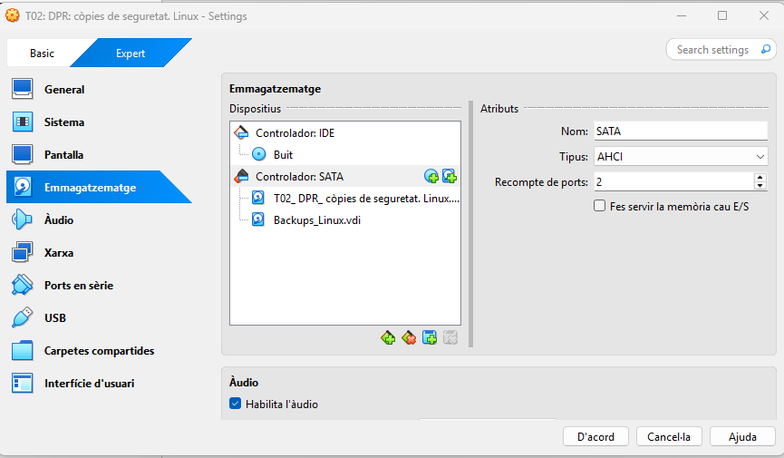

Quan entrem a la màquina, verifiquem que aquest disc sigui detectat.

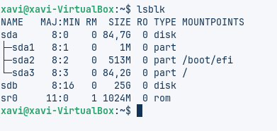

Generem una partició al nou disc amb la comanda

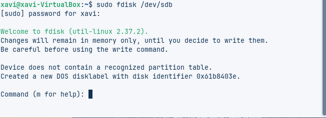

Quan ens aparegui el 'menú', seguirem les instruccions:

n → Per crear una nova partició
p → Per indicar que és primària
Enter
Enter
Enter
W → Per guardar i sortir

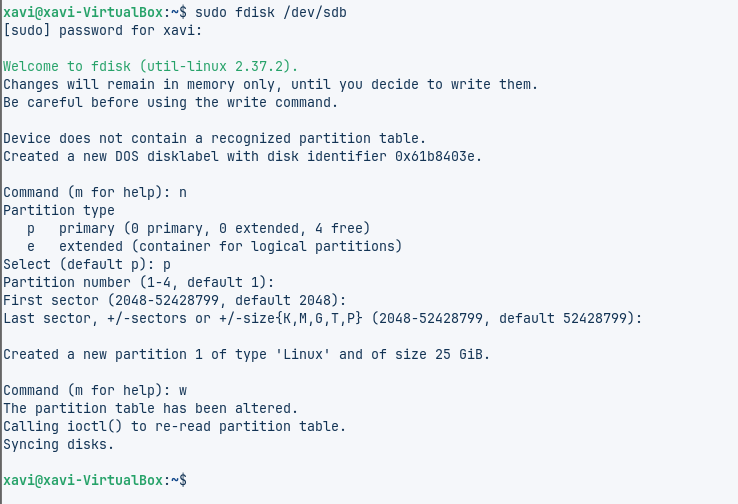

Formategem el disc en format XFS, però abans haurem d'instal·lar el servei XFS.

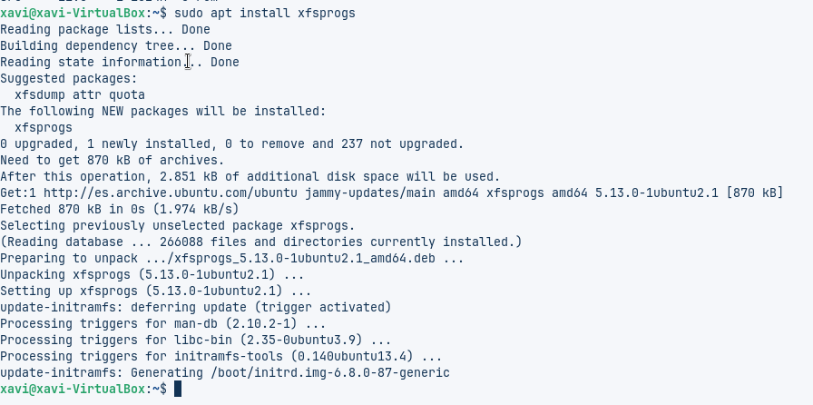

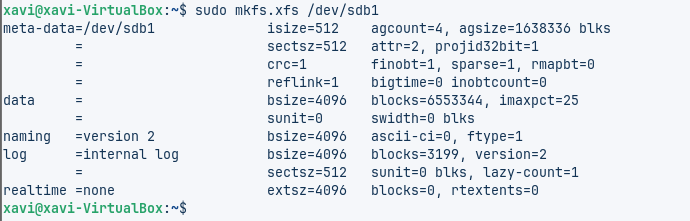

A continuació, crearem un directori i hi muntarem el disc corresponent.

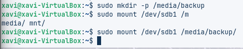

Seguidament, podem confirmar que s’ha muntat correctament fent servir la comanda corresponent.

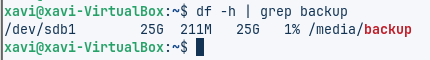

Tot seguit instal·larem duplicity, la utilitat que permet automatitzar les còpies de seguretat.

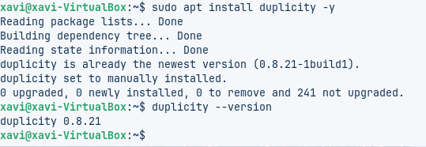

Donarem d’alta dos usuaris nous i ens assegurarem que cadascun tingui la seva carpeta pròpia.

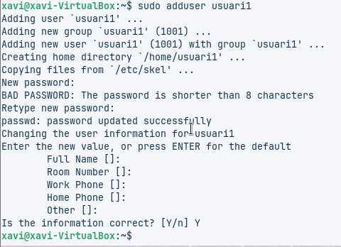

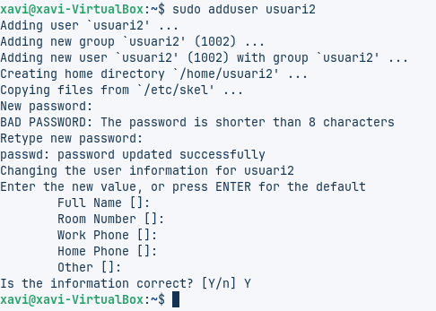

A continuació generarem quatre arxius de 10 MB a l’interior del directori creat prèviament.

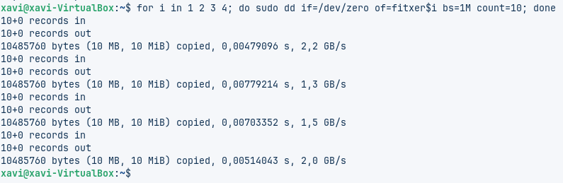

Per poder comprobar si ho hem fet bé, fem la seguent comanda:

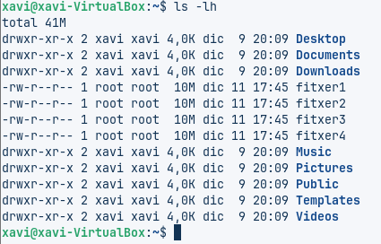

Realitzarem la còpia de seguretat amb duplicity; durant el procés ens sol·licitarà una frase de pas, que servirà per xifrar-la.

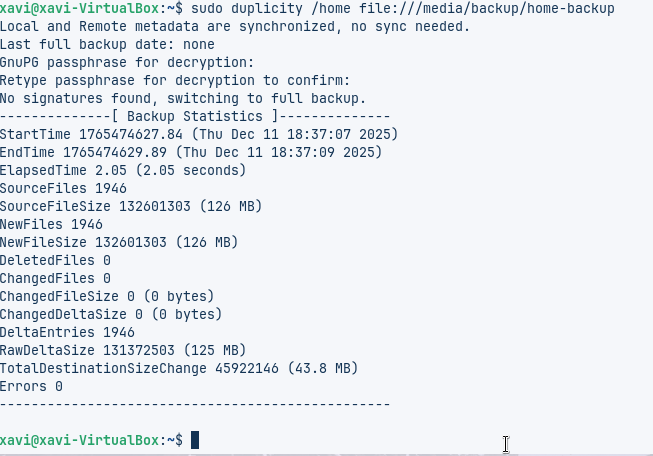

Un cop finalitzat el procés, es pot comprovar el contingut que s’ha generat dins del directori de destinació.

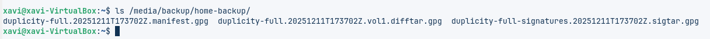

