# T02: DPR: còpies de seguretat. Cas pràctic

Part 1: Còpia seguretat dels equips clients Windows

Haurem de configurar una maquina virtual Windows afegint un disc dur (virtual) de 10 GB per a les còpies.

Ara, descaragrem duplicati per Windows.

Seguidament, un cop descargat, haurem d'aacedir, quan accedim per primer cop ens demanara introduir una contrasenya, quan ja estigui introduïda ja estrem dins de duplicati.

Ara crearem un nou backup a l'opció que surt "Add +"

Seguirem els passos demanats i introduirem nom, descripció, xifratge, contrasenya…

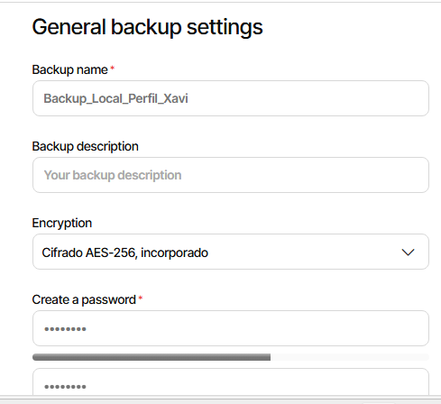

Tot seguit, seleccionem la destinació del nostre sistema "File System"

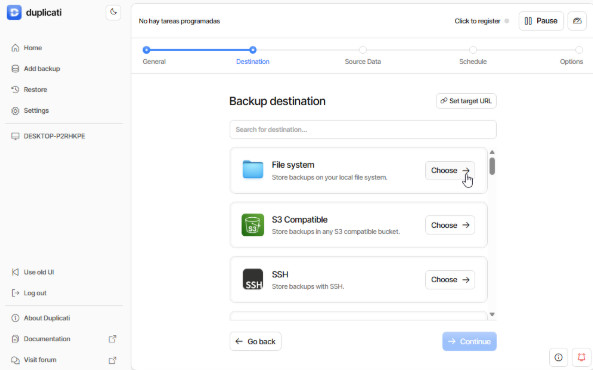

A continuació, haurem d’escollir la ubicació del nostre disc on es desaran les còpies. Si el disc no hi apareix, serà necessari inicialitzar-lo, tal com vam aprendre al primer curs.

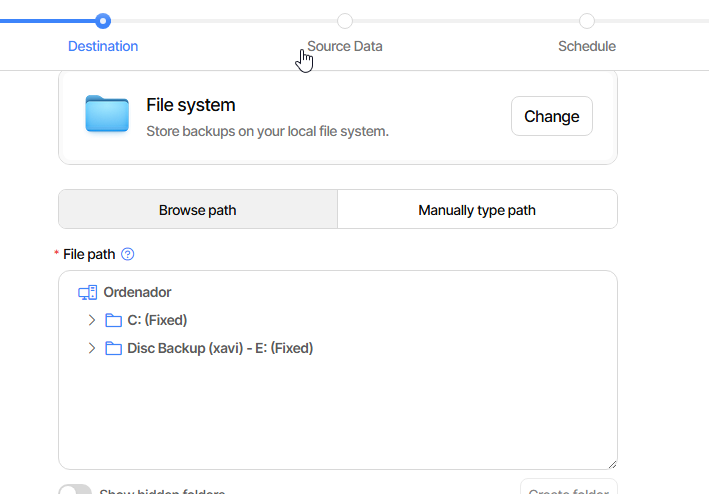

Caldrà triar quines dades volem o des d’on s’han d’extreure.

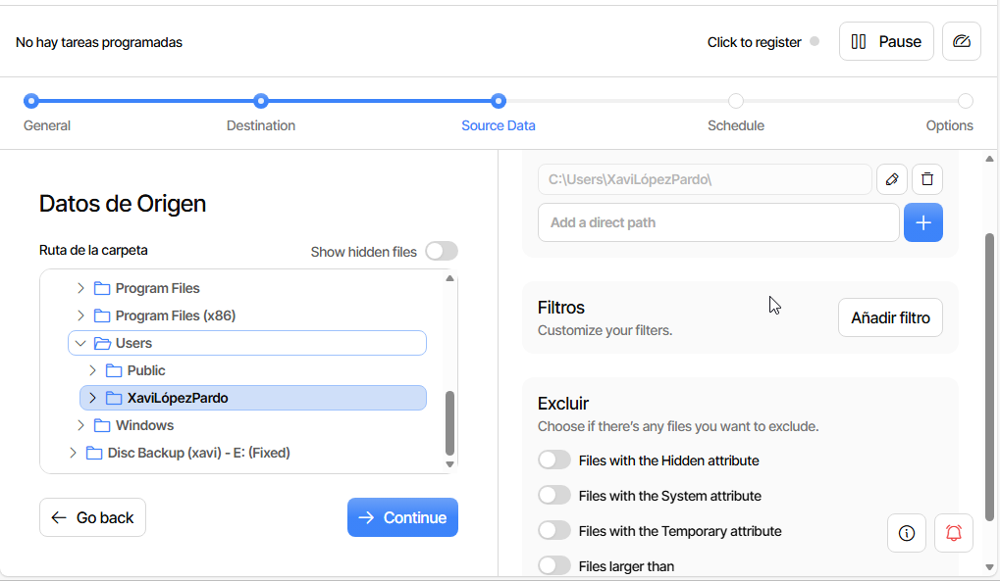

Farem click a "->continue" i escollirem quan s’executa la còpia.

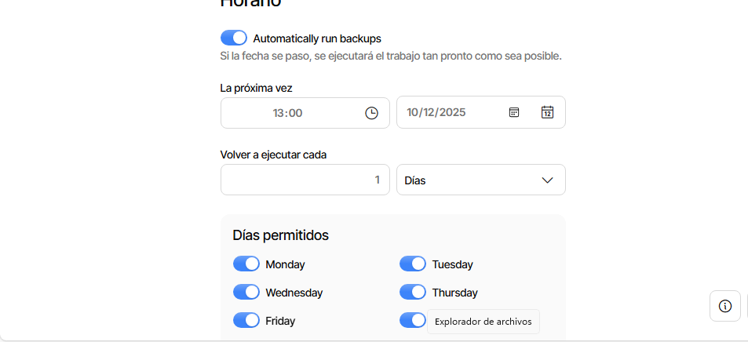

Tot seguit, haurem d’afegir l’opció passphrase per introduir una contrasenya.
A més, també caldrà incorporar l’opció snapshot-policy.

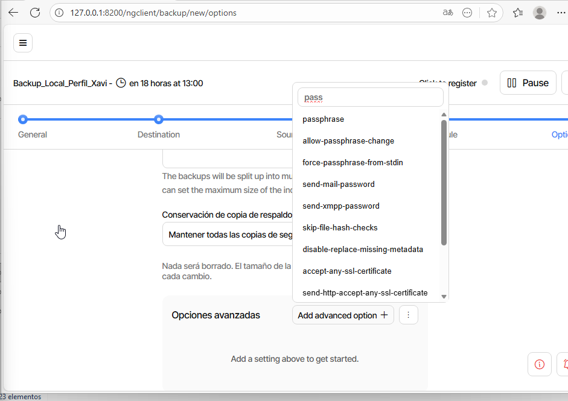

Ara podrem veure que el backup ja s’ha creat correctament i l’executarem per comprovar que funciona adequadament.

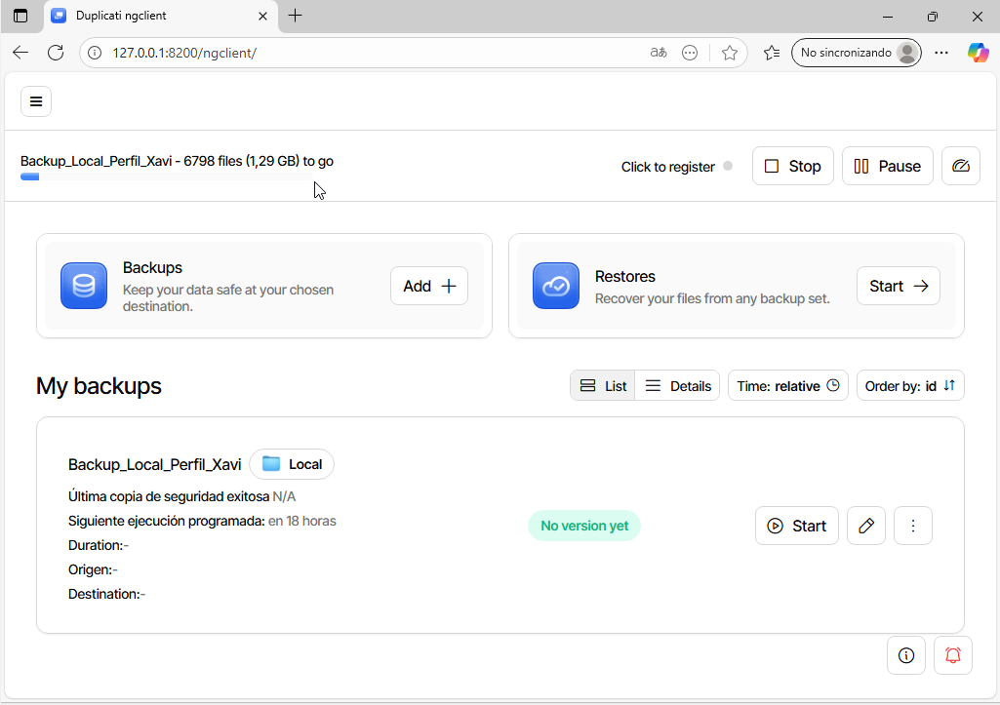

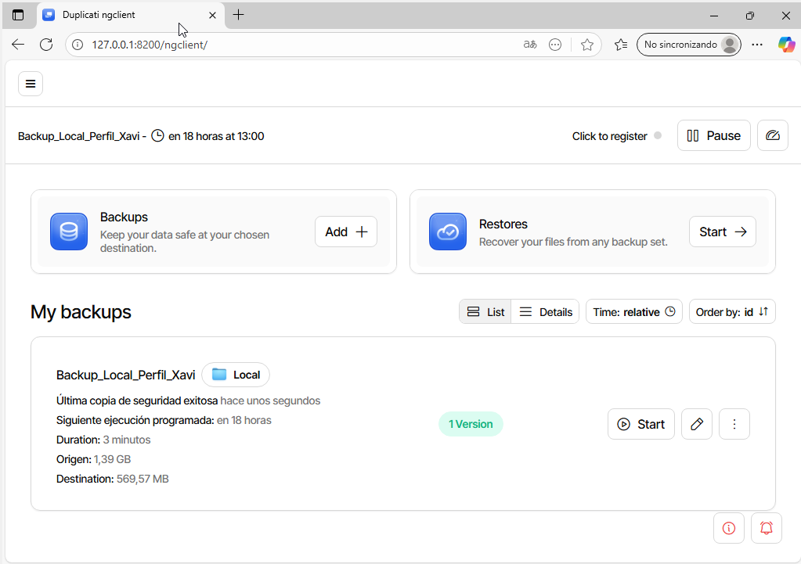

Un cop el procés ha finalitzat, si obrim l’explorador d’arxius, podrem veure que les dades s’han desat de manera encriptada.

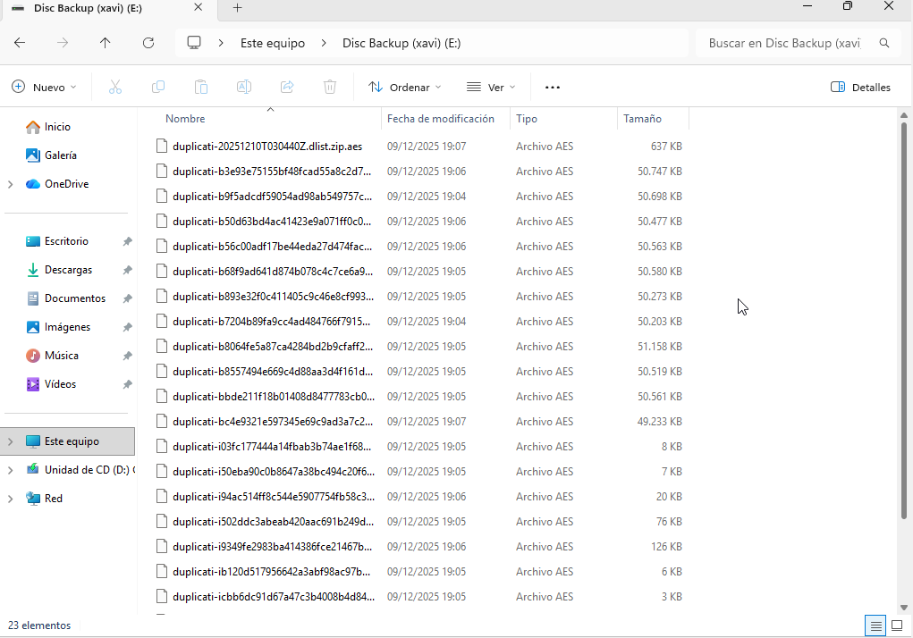

Ara aprendrem a crear còpies de seguretat a Google Drive.
Crearem un nou backup, però aquesta vegada seleccionarem Google Drive com a destí.

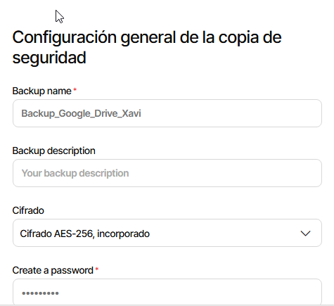

Quan avancem, haurem de vincular Duplicati amb Google Drive. Per fer-ho, farem clic a l’enllaç AuthID i vincula amb el compte de google drive.

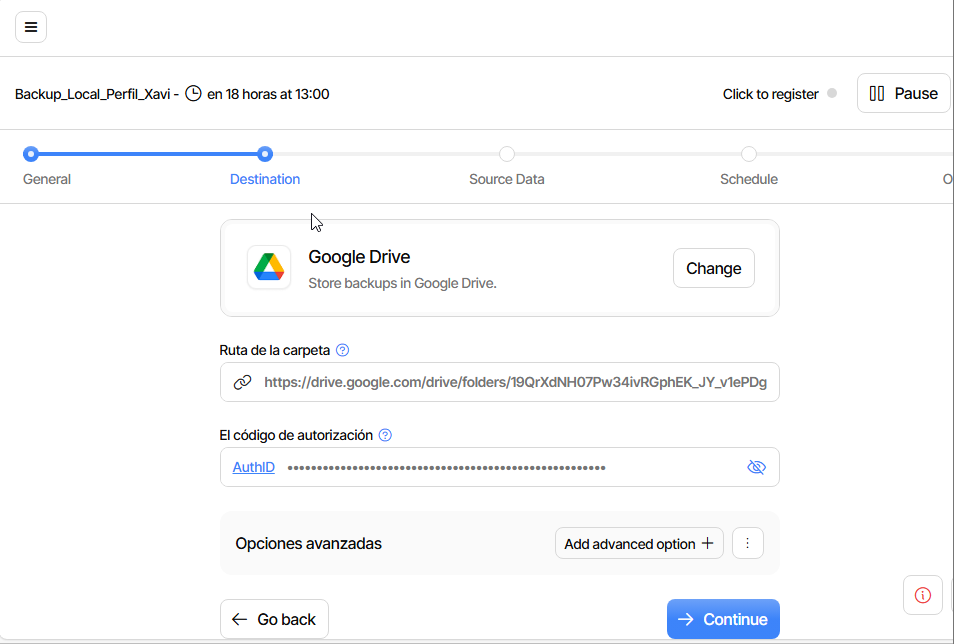

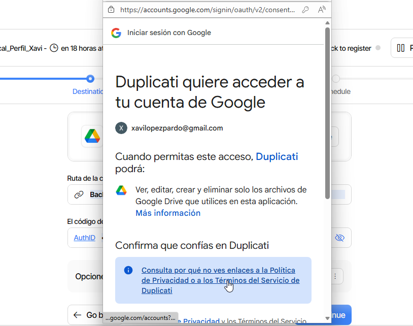

