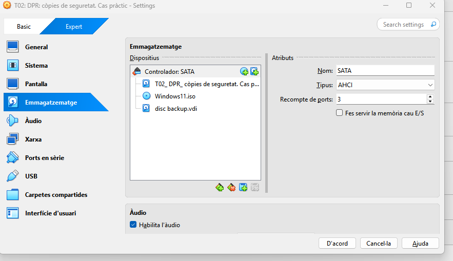
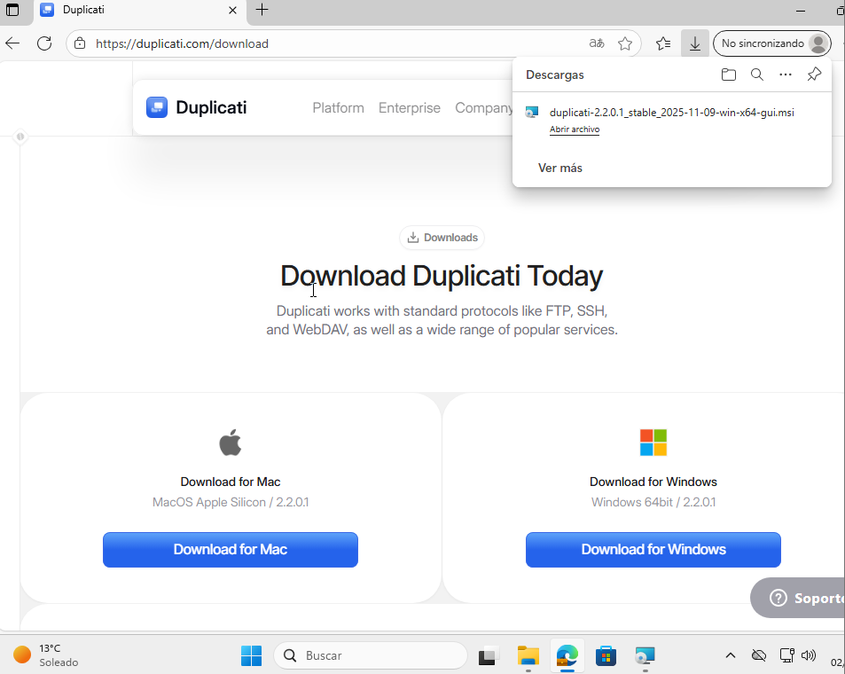
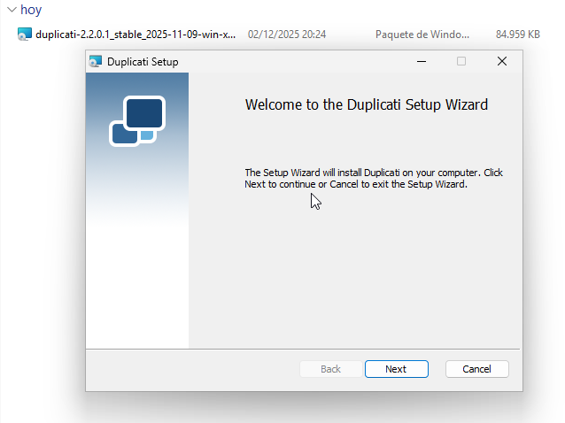
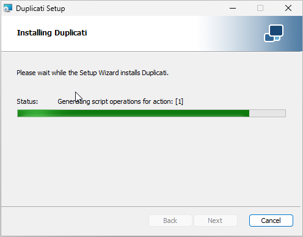
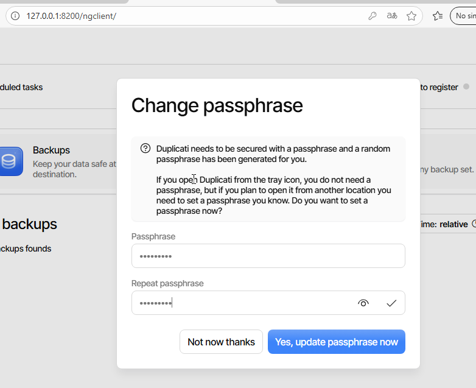
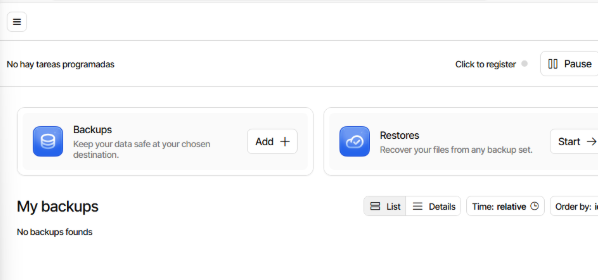

# T02: DPR: còpies de seguretat. Cas pràctic

Part 1: Còpia seguretat dels equips clients Windows

Haurem de configurar una maquina virtual Windows afegint un disc dur (virtual) de 10 GB per a les còpies.

Ara, descaragrem duplicati per Windows.

Seguidament, un cop descargat, haurem d'aacedir, quan accedim per primer cop ens demanara introduir una contrasenya, quan ja estigui introduïda ja estrem dins de duplicati.

Ara crearem un nou backup a l'opció que surt "Add +"

