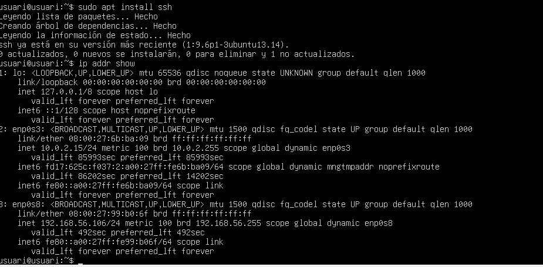
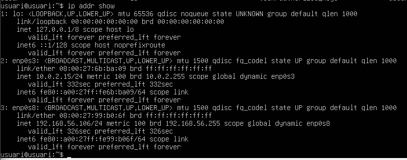
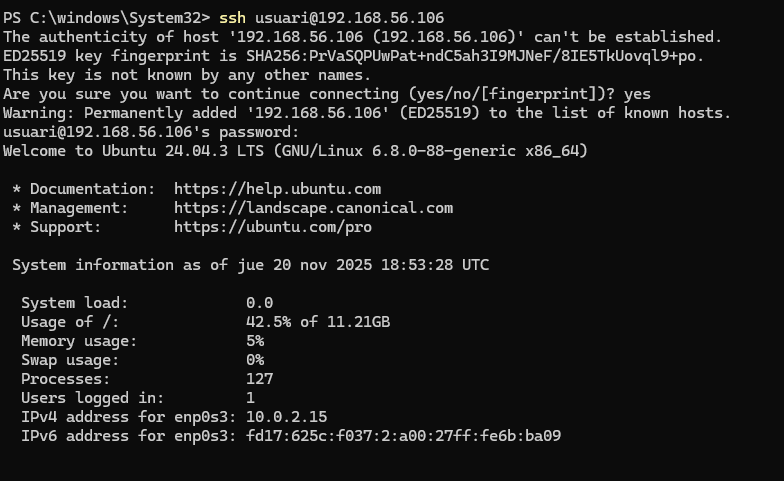
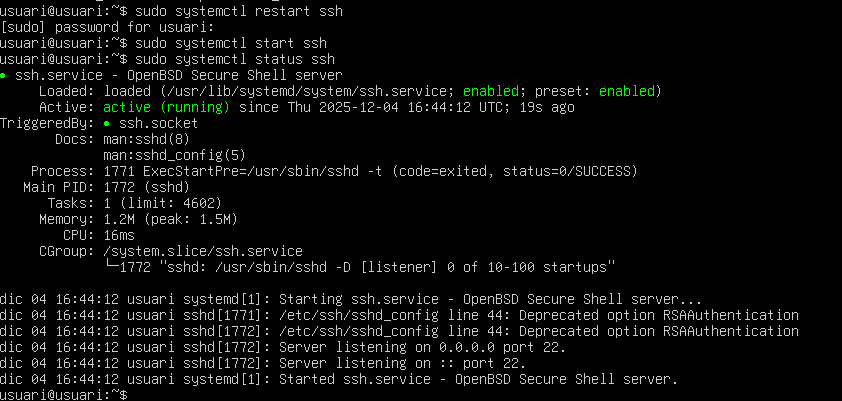
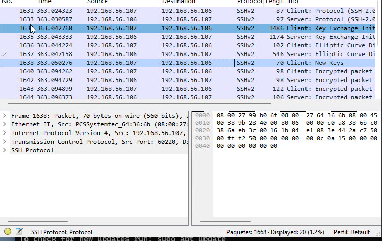

# Índex

- Instal·lació del servidor SSH

- Verificació de la connexió SSH

- Configuració del servidor SSH

- Gestió d'usuaris i permisos

- Creació de túnels SSH i ús de proxy SOCKS

## Instal·lació del servidor SSH

Per instal·lar el servei SSH a Ubuntu Server, executa:

sudo apt install ssh

Després, verifica l'adreça IP del servidor amb:

ip addr show

# Verificació de la connexió SSH

Des del client Windows, obrir PowerShell i connectar al servidor amb:

ssh usuari@192.168.56.106

La primera vegada, se't demanarà confirmar l'autenticitat del host:

Un cop connectat, veuràs el missatge de benvinguda del sistema Ubuntu:

# Configuració del servidor SSH

El fitxer de configuració es troba a:

/etc/ssh/sshd_config

Algunes opcions importants:

PermitRootLogin prohibit-password
StrictModes yes
RSAAuthentication yes
PubkeyAuthentication yes
AuthorizedKeysFile %h/.ssh/authorized_keys

Per aplicar els canvis:

sudo systemctl restart ssh

# Gestió d'usuaris i permisos

Crear un nou usuari amb:

sudo adduser usuari2

# Creació de túnels SSH i ús de proxy SOCKS

Pots crear un túnel SSH amb:

ssh -D 9876 usuari@192.168.56.106

Després, configura el navegador per utilitzar un proxy SOCKS a 
127.0.0.1
9876

Verifica amb Wireshark que el trànsit es redirigeix pel túnel SSH:

A les ip's que surt als paquets de ssh, son les del servidor i les del client.

