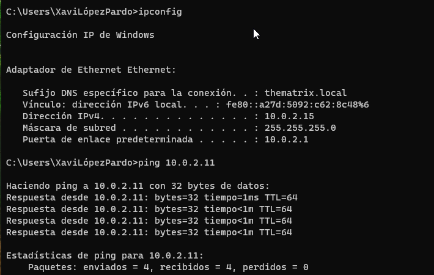
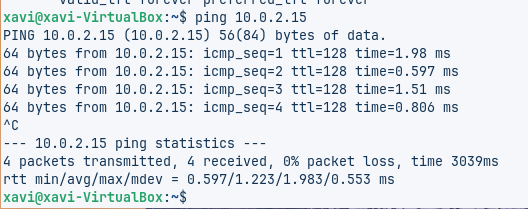
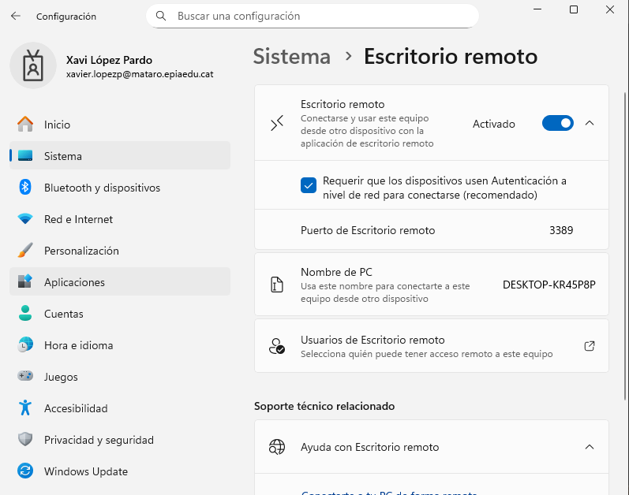
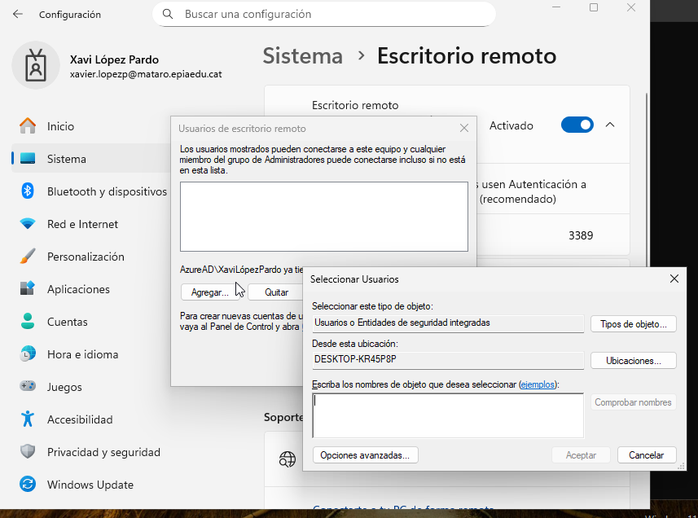
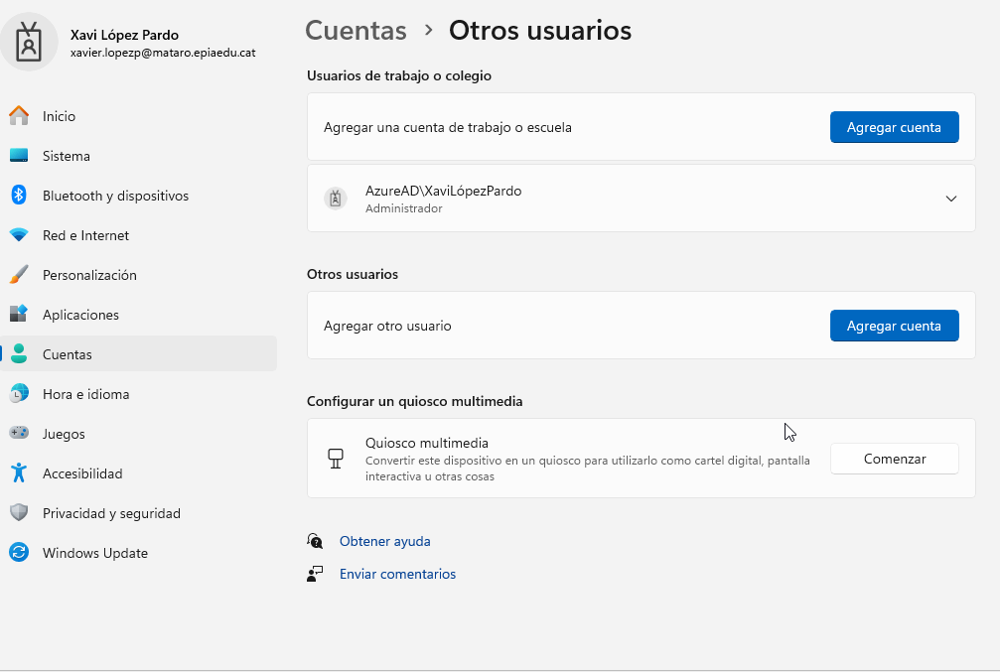
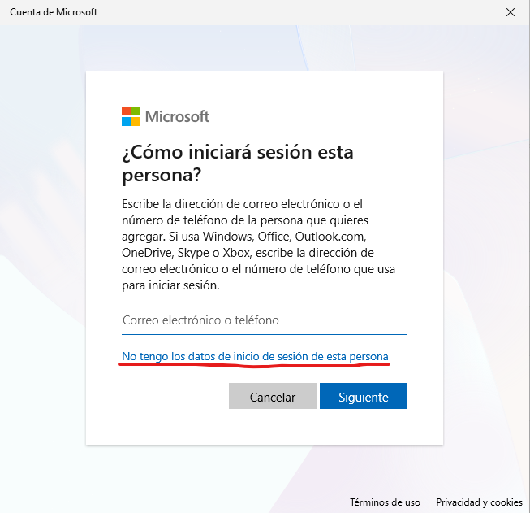
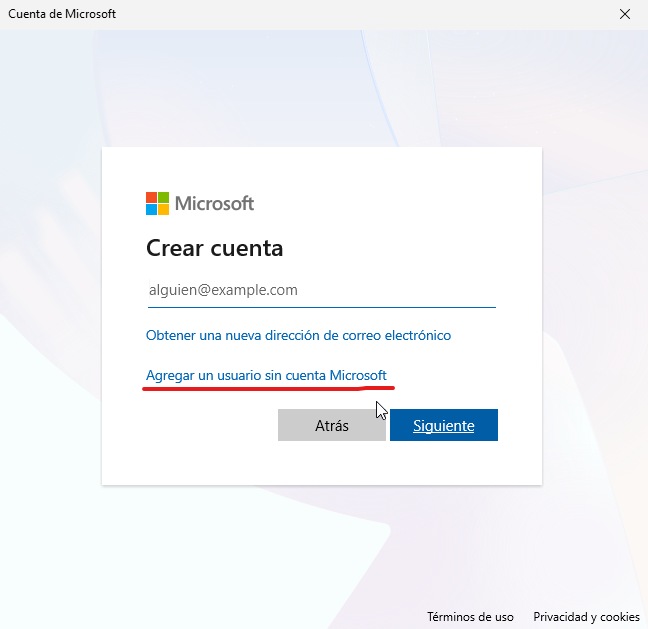
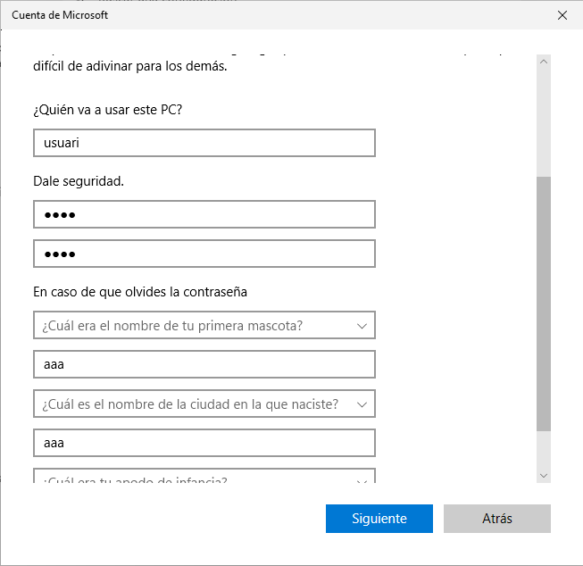
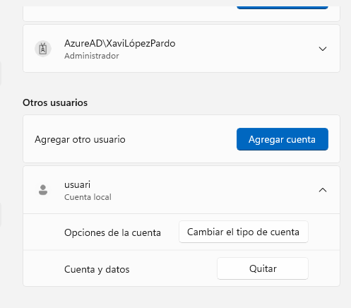
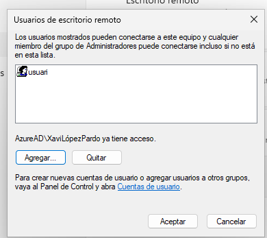

# T06: Accés remot - Escriptori remot (RDP)  

Per a fer aquesta pràctica haurem de tenir dues VM Windows i Zorin, les dues amb xarxa NAT per a que puguin veures entre elles dins la xarxa.
Farem comprovacions inicials amb ping entre elles.

Primer de tot, haurem de tenir una màquina virtual amb Windows i activar l’escriptori remot en aquesta. Des de configuració → Sistema → Escritorio remoto

Ara, afagerim un usuari d'escriptori remot

