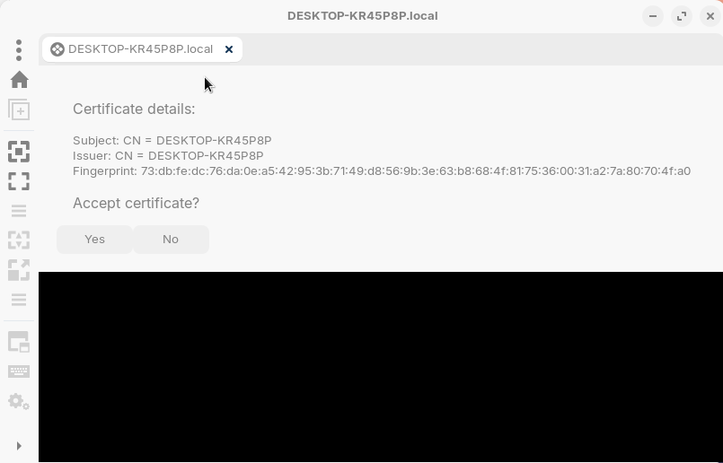
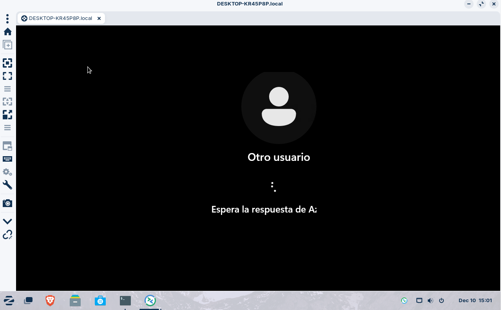
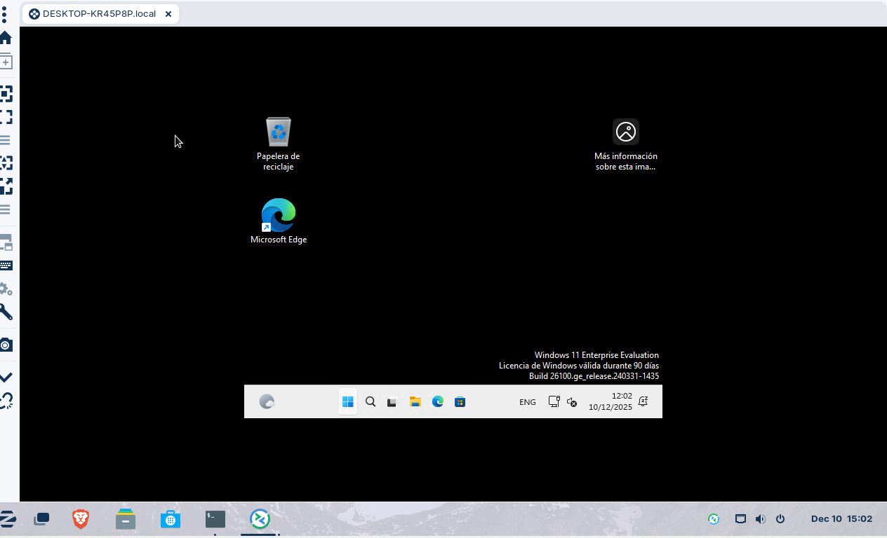
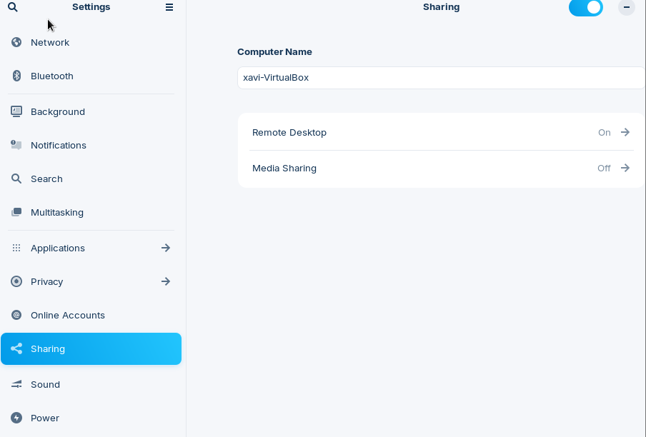
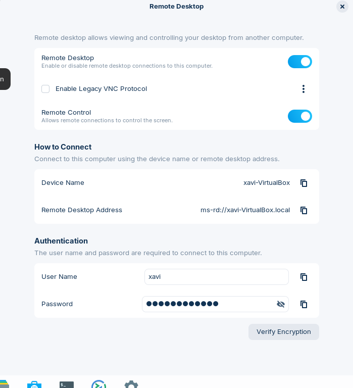
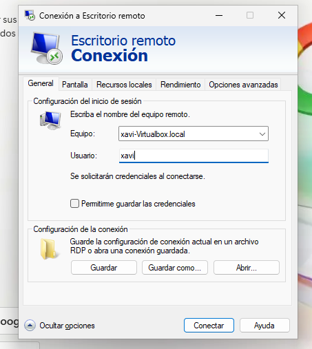
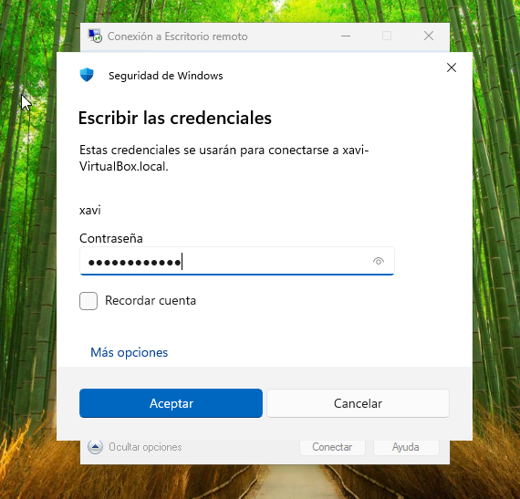
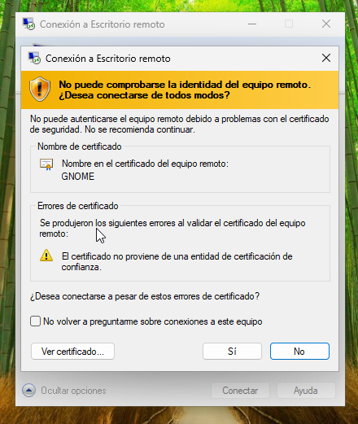
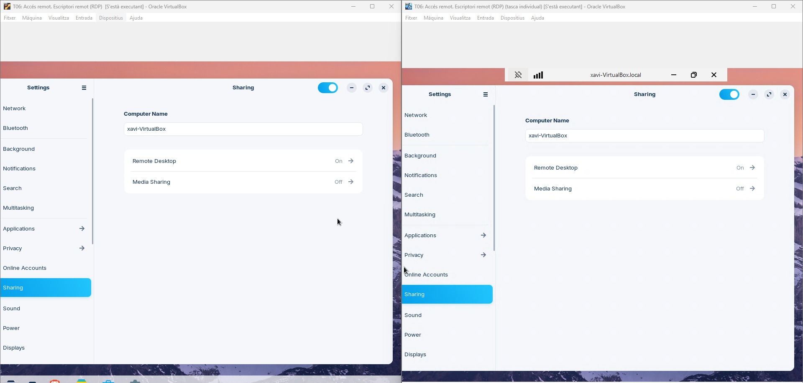

# T06: Accés remot - Escriptori remot (RDP)  

Per a fer aquesta pràctica haurem de tenir dues VM Windows i Zorin, les dues amb xarxa NAT per a que puguin veures entre elles dins la xarxa.
Farem comprovacions inicials amb ping entre elles.

Primer de tot, haurem de tenir una màquina virtual amb Windows i activar l’escriptori remot en aquesta. Des de configuració → Sistema → Escritorio remoto

Ara, afagerim un usuari d'escriptori remot

Seguidament, haurem d’entrar a la segona VM, una màquina amb Zorin. Provarem de conectarnos al escriptori remot de Windows per fer-ho hem d’obrir Remmina.

Ara activarem el control remot a Zorin, per fer-ho accedim a "Settings" → Share → On "Share Screen" seguidament activem "Remot Desktop" → Set Password.

Tot seguit, des de Windows ara podem conectarnos a zorin, amb Escritorio Remoto. Obrirem l’aplicació i introduïrem les dades d’acces. Les dades que haurem d'introduir, són les següents:
Equipo: usuari-VirtualBox.local 
Usuario: usuari

Aquí, haurem d'introduir la contrasenya que esta abaix de tot on ens surtia a la captura anterior

Un cop ens surti la seguent pestanya, haurem de clickar a "Sí" i ja estrem conectats de forma remotamanent

