  # Servidor NFS

Cal desplegar dues màquines virtuals, una amb el rol de Client i una altra amb el rol de Servidor. Cada VM haurà de disposar de dos interfícies de xarxa: una configurada en mode NAT i una altra configurada en mode host-only.
S'haurà de actualitzar el sistema operatiu a les dues màquines.
________________________________________________________________________________________________________________________________________________________________________________________________________________________

```bash
sudo apt update -y && sudo apt upgrade -y
```
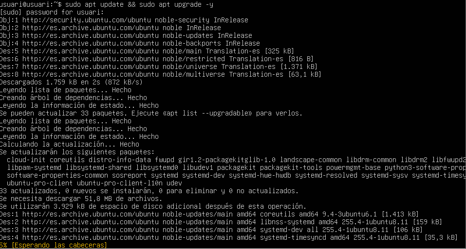

________________________________________________________________________________________________________________________________________________________________________________________________________________________

Seguidament, farem un ping a les dues màquines per saber si estan conectades.

```bash
ping IP_CLIENT
```

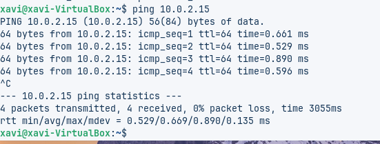

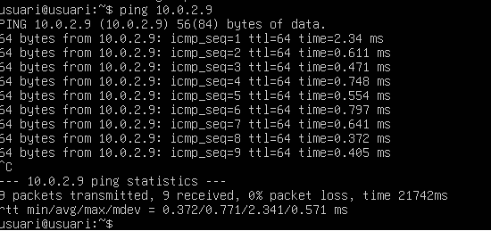w

```bash
ping IP_SERVIDOR
```

________________________________________________________________________________________________________________________________________________________________________________________________________________________

Ara, dins del servidor, crearem dos grups devs i admins

```bash
sudo groupadd devs
```
```bash
sudo groupadd admins
```

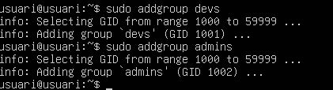

________________________________________________________________________________________________________________________________________________________________________________________________________________________

Tot seguit, crearem dos usuaris:

```bash
sudo adduser dev01
```
```bash
sudo adduser admin01
```
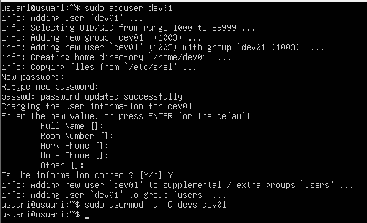

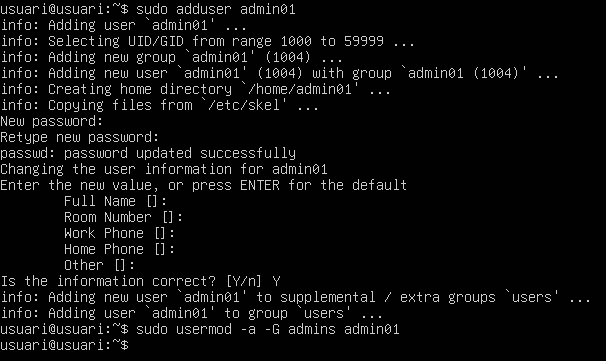

________________________________________________________________________________________________________________________________________________________________________________________________________________________

Crearem els seguents directoris:

```bash
sudo /srv/nfs/dev_projectes
```
```bash
sudo /srv/nfs/admin_tools
```

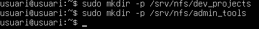

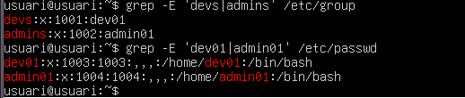

________________________________________________________________________________________________________________________________________________________________________________________________________________________

El grup Devs tindra control total sobre els seus projectes El grup Admins tindra control total sobre les seves eines l'usuari propietari de tots dos casos serà root.

```bash
sudo chown root:devs /srv/nfs/dev_projectes/
```
```bash
sudo chown root:admins /srv/nfs/admin_tools/
```
```bash
sudo chmod 770 /srv/nfs/dev_projectes/
```
```bash
sudo chmod 770 /srv/nfs/admin_tools/
```
Ara, amb aquesta comanda comprobarem els permisos:

```bash
ls -la /srv/nfs/
```

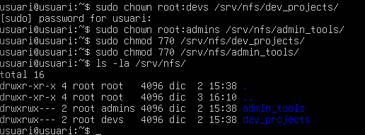

________________________________________________________________________________________________________________________________________________________________________________________________________________________

Tot seguit, instal·larem el servei NFS:

```bash
sudo apt install nfs-kernel-server
```

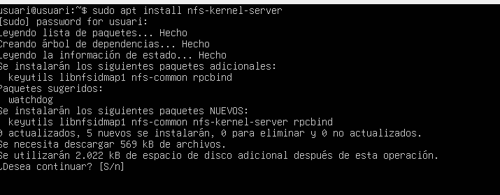

I l'haurem d'habilita el serveri NFS

```bash
sudo systemctl enable nfs-kernel-server
```

```bash
sudo systemctl start nfs-kernel-server
```

```bash
sudo systemctl system nfs-kernel-server
```

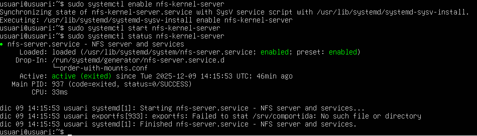

________________________________________________________________________________________________________________________________________________________________________________________________________________________

Ara al Client haurem de configurar amb les mateixes gid i uid els usuaris i grups.
Primer de tot, en el servidor, haurem d'executar la seguent comanda i ens haurem d'apuntar el que ens diu:

```bash
id admin01 && id dev01
```
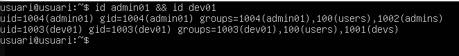

Un cop haber apuntat tot, anirem a la màquina del client, i executarem les seguents comandes:

```bash
sudo groupadd -g 1002 admins
sudo groupadd -g 1001 devs
```

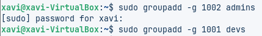

```bash
sudo adduser --uid 1004 admin01
sudo adduser --uid 1003 dev01
```

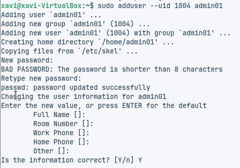

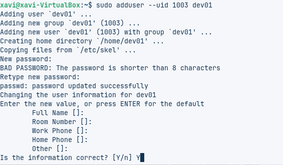

```bash
sudo usermod -a -G admins admin01
sudo usermod -a -G devs dev01
```

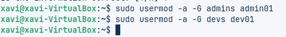

I per verificar que esta tot correctament:

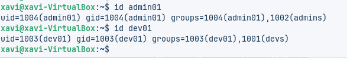

________________________________________________________________________________________________________________________________________________________________________________________________________________________

Seguidament, haurem d'instal·lar nfs que necessitem

```bash
sudo apt install nfs-common -y
```

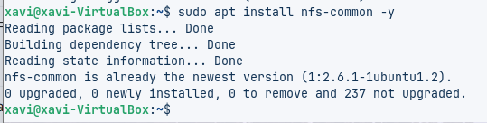

________________________________________________________________________________________________________________________________________________________________________________________________________________________

Al servidor, modificarem l'arxiu /etc/exports per permetre exportar el nostre directori

```bash
sudo nano /etc/exports
```
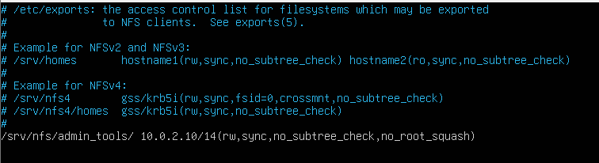

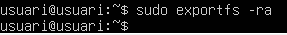

Si anem a la màquina del client, podrem verificar que esta exportant al servidor

```bash
sudo showmount -e 10.0.2.10
```

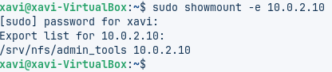

Ara si, podem muntar el directori del servidor a un dels directoris del client

```bash
sudo mount -t nfs 10.0.2.6:/srv/nfs/admin_tools /mnt/admin_tools/
```

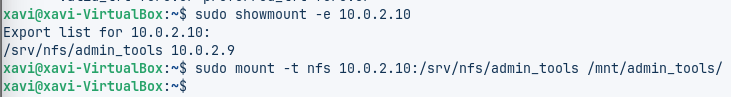

Comprobem com els arxiu estan disponibles en el directori on hem muntat els arxius, podem fer-ho amb comandes (ls) o des del gui.

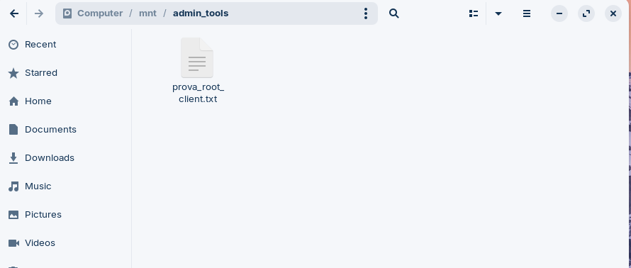

Ara configurem el client per a que es monti automàticament la nostra carpeta al iniciar sessió. Això ho farem editant l'arxiu /etc/fstab

```bash
sudo nano /etc/fstab
```

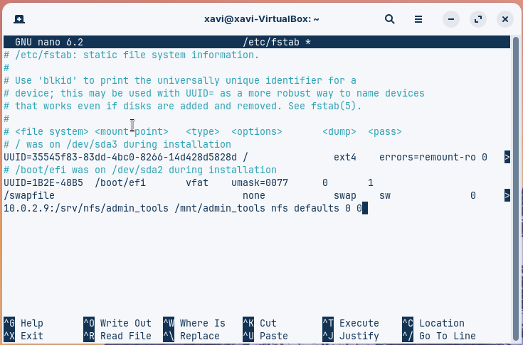

Ara com a pas final caldrà fer el mateix per a el directori de devs (muntar-lo i configurar)
Des del servidor afegim una nova línea a l'arxiu /etc/exports per configurar el directori.
Afegim:

```bash
/srv/nfs/dev_projects/ 10.0.2.9(rw,sync,no_subtree_check,no_root_squash)
```

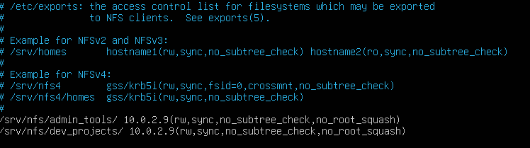

Seguidament, hauriem de fer el maeix procés per l'altre group, ara podriem veure com l'arxiu s'ha creat correctament:

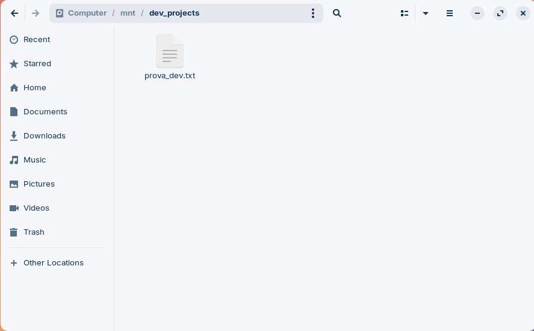


